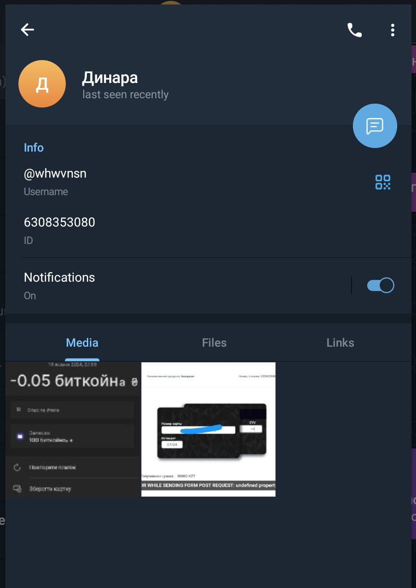
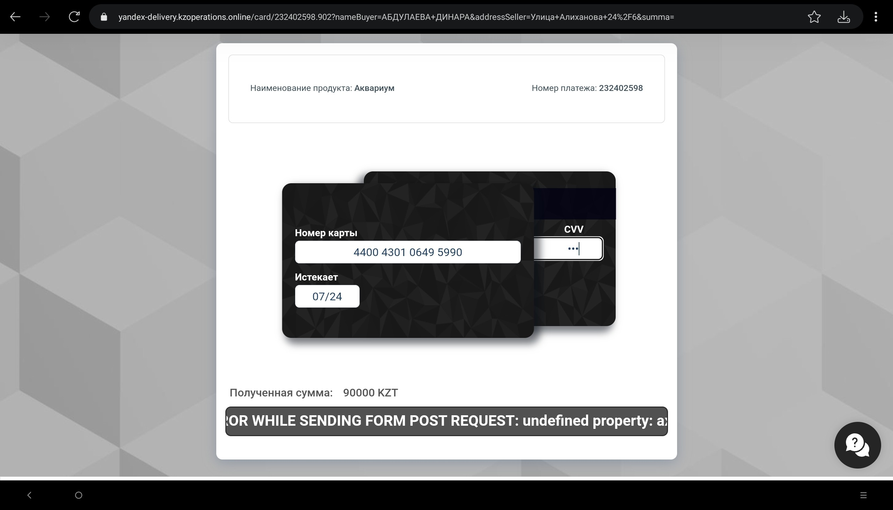
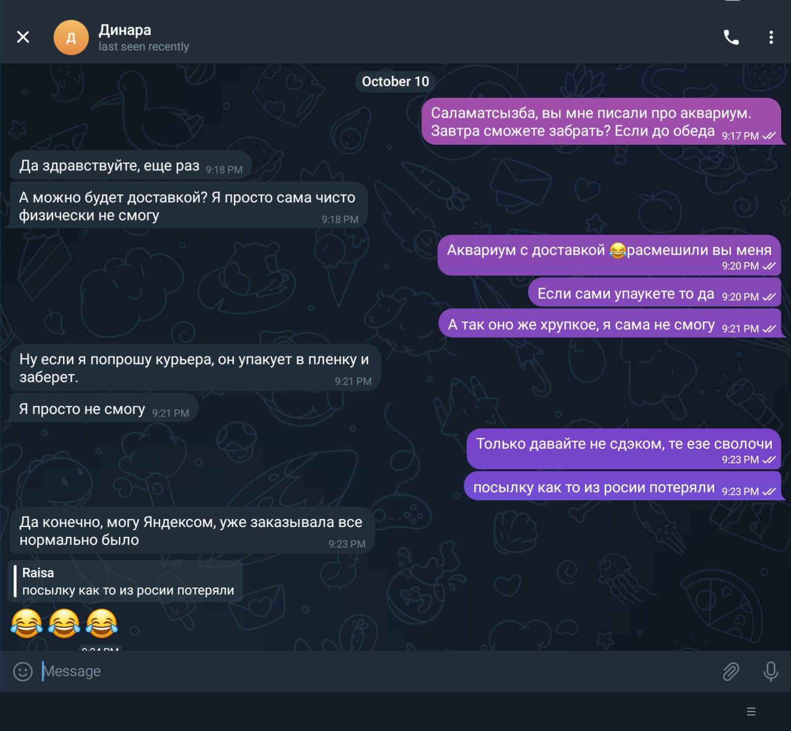
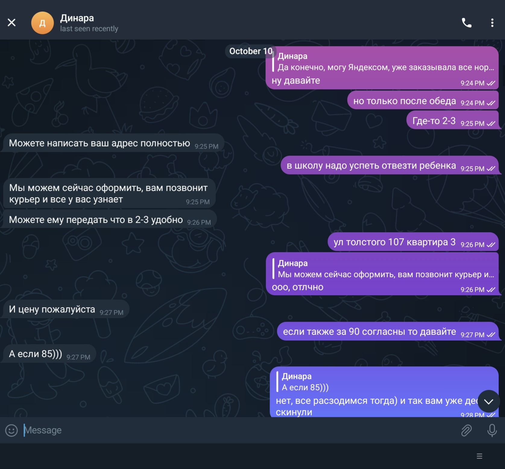
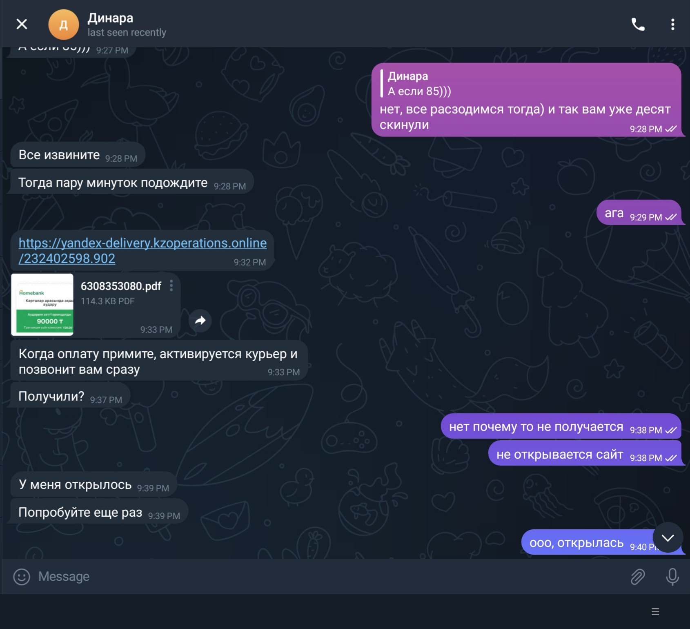
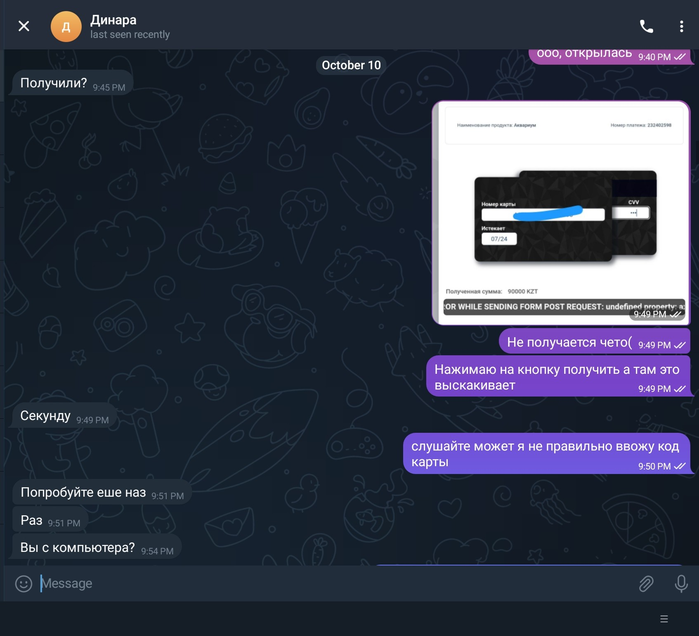
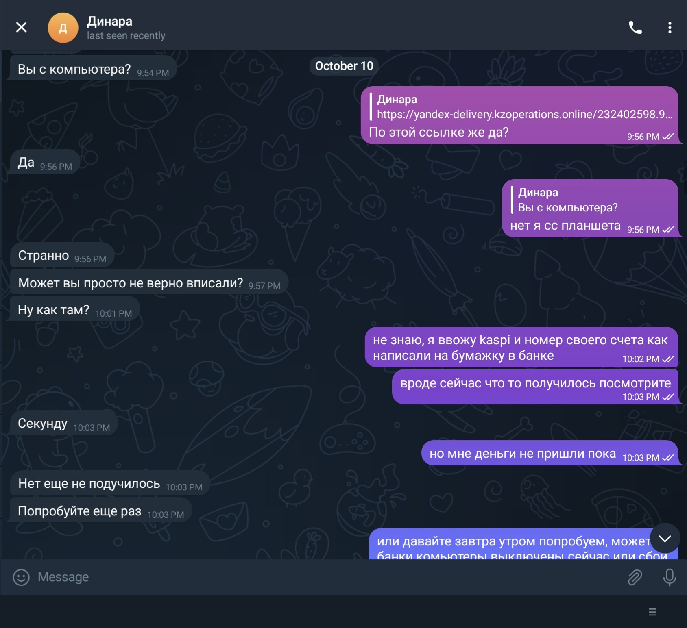
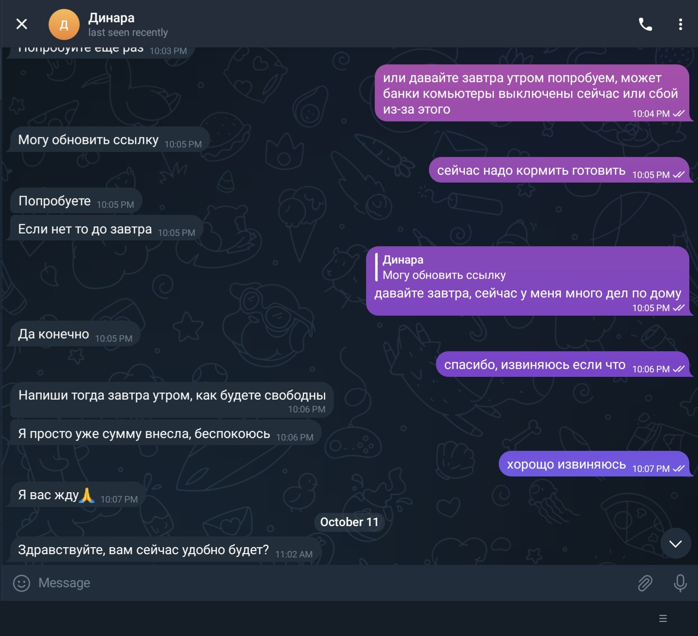

Я живу в Казахстане, по профессии музыкант, как хобби занимаюсь разработкой ПО и увлекаюсь OSINT. Периодически выкладываю объявления на OLX — продавал аквариум, цена была около 100к тенге. Спустя пару дней после того как я разместил объявление и купил VIP-пакет — мне написал некий человек с просьбой перейти в Telegram. Я сразу понял, что это развод, и не отвечал 3–5 дней. Потом всё же решил ответить — и заодно попробовать его деанонимизировать.

Схема очень простая: тебя просят перейти в Телеграм, присылают ссылку, где надо ввести данные своей карты — и всё, деньги уходят скамеру.

---

Его **Telegram:** `@whwvnsn` — ID: `6308353080`, предположительно зарегистрирован в октябре 2023 года.



Он скинул мне домен для ввода данных карты — `KzOperations.online`. IP: `194.58.112.174`, создан `2023-10-07` — почти одновременно с Telegram-аккаунтом. WHOIS по этому домену ничего полезного не дал, однако я нашёл очень похожий домен с другим TLD, который работал полгода назад — `post-kz.kzoperations.shop`. URLScan определил его как фишинговый: [результат сканирования](https://urlscan.io/result/aac994ab-5183-4a61-9837-0ed6dbe6fbf9#summary). Домен работал за Cloudflare — `188.114.96.3`, создан `2023-02-02`.



Покопавшись в интернете, я нашёл WHOIS-запись этого домена на [service.loxotrona.net](https://service.loxotrona.net/check/post-kz.kzoperations.shop). Почти всё — мусор, но один элемент зацепил: почта `badboy8905@gmail.com`. Я сделал reverse-lookup WHOIS по ней и получил **276 результатов** на [whoxy.com](https://whoxy.com/email/163061384) и **77** на [viewdns.info](https://viewdns.info/reversewhois/?q=badboy8905%40gmail.com). Судя по датам, человек занимается этим примерно с августа 2022 года.

---

А вот как выглядела переписка в Telegram — мошенник действовал под именем «Динара»:













---

## Что мне удалось найти по email: badboy8905@gmail.com

**Google:**

- GAIA ID: `108070244582627351651`
- [Архив Google+ профиля](https://web.archive.org/web/*/plus.google.com/108070244582627351651)

**Утечки COMB** — нашёл несколько пар логин/пароль:

```
badboy8905@email.com   : sasha00
badboy8905@gmail.com   : Ghost_99gg
badboy8905@gmail.com   : PaTrOnAs0000
badboy8905@gmail.com   : sasha00
badboy8905@mail.ru     : PaTrOnAs0000
badboy8905@mail.ru     : sasha00
badboy8905@yandex.ru   : sasha00  -> аккаунт не найден в Yandex
```

**OK.ru:** имя (частично) `Ghost A***`, 23 года, зарегистрирован 4 ноября 2018 года.

---

Через OSINT-утилиты я вытащил его аккаунт на **lolz.guru** из слитой базы 2018 года:

```
ID:                70489
Ник:               Ghost_99gg
Пол:               male
Часовой пояс:      Europe/Athens
Email:             badboy8905@gmail.com
Дата регистрации:  2017-01-04 11:03:00
```

А вот что нашлось в утечке базы **Новой Почты Украины [2016–2022]** — и это уже реально интересно:

```
ФИО:       Alexsandr Chertopolokh / Чертополох Александр Юрьевич
Адрес:     Ponornytsya, Kovpaka 27
Город:     Koropskyi / смт. Понорниця, Чернігівська обл., Коропський р-н
Страна:    Ukraine
Телефон:   +380636252658
Email:     badboy8905@gmail.com
Доставка:  Відділення №1, вул. Гагаріна, 2 — Понорниця
```

Теперь у меня есть имя, адрес и телефон. Двигаемся дальше.

---

## Пробиваем телефон: +380636252658

- **GetContact:** Сашко
- **Оператор:** Life:) 🇺🇦 Украина

**OK.ru:** имя `OTPOK Cw`, 13 июля 1997 г.р. (26 лет на тот момент), профиль [ok.ru/profile/567937246291](https://ok.ru/profile/567937246291) ([архив](https://web.archive.org/web/20231015060050/https://ok.ru/profile/567937246291)), город — Киев, email `badboy8905@gmail.com`, зарегистрирован 4 февраля 2016.

Я загуглил его ФИО и вышел на страницу обмена криптовалюты: [clickpay.cx/ru/order/2WY4WU1WZRO](https://clickpay.cx/ru/order/2WY4WU1WZRO). В исходниках той страницы я нашёл ту же почту и ещё:

- **Карта:** `5375 4114 1209 6997` — Universalbank (Mastercard, Debit)
- **Телефон:** `+380954543439` → GetContact: «Чертополох Саша», Telegram: `@alex004k`

---

## Дополнительные зацепки

По паролю `PaTrOnAs0000` из утечки я вычислил его смежные почтовые ящики:

```
badboy8904@mail.ru
badboy8905@gmail.com
badboy8905@mail.ru
badboy8906@mail.ru
```

По паролю `sasha00` (через Глаз Бога) вылезло много номеров, но я зацепился за два интересных:

- `+380935603722` → GetContact: «Саша Мой» → Telegram: `@chertopolokh_69` — тут уже без вариантов
- `+380965834883` → GetContact: «Саша» → Telegram: имя `C` — сложно сказать, его ли

Ящик `badboy8906@mail.ru` ведёт на [my.mail.ru/mail/badboy8906](https://my.mail.ru/mail/badboy8906/) ([архив](https://web.archive.org/web/20231015055941/https://my.mail.ru/mail/badboy8906/)) — судя по профилю, человек увлекался игрой Contact Wars. Имя: «саша иванов», телефон: `+380966******`. На той же почте ICQ: [icq.im/badboy8906@mail.ru](https://icq.im/badboy8906@mail.ru), имя тоже «саша иванов».

Ещё нашёлся Twitter-аккаунт `@badboy8906` ([архив](http://web.archive.org/web/20231015060816/https://twitter.com/badboy8906)) — похоже, использовался как приманка для определённой аудитории.

Ну и напоследок — этот же человек засветился на Pinkbike: [Are High Pivots Only for Downhill Riding? — Pinkbike Weekly Show Ep. 16](https://www.pinkbike.com/news/video-are-high-pivots-only-for-downhill-riding--pinkbike-weekly-show-ep-16.html).

---

## Итог

Мне удалось установить **ФИО, адрес, страну проживания, несколько номеров телефона, email-адреса, аккаунты в соцсетях и мессенджерах**. Всю собранную информацию я передал в киберполицию Украины. Надеюсь, что дело дойдёт до дела.
